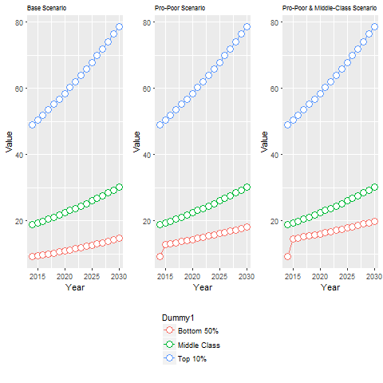

Using Microsimulation to forecast household demand for electricity, given changes in poverty and equality
========================================================
author: Chak Wong
date: 10/13/2017
autosize: true

Outline
========================================================
- Background
- Introduction
- Microsimulation
- Methods
- Scenarios & Economic Policies
- Results
- Summary
- Next Steps

Background
========================================================
- The United Nations adopted the 2030 Sustainable Development Goals (SDGs), a call to action towards poverty eradication, environmental sustainability, and social equality.
- Sustainable Development: Human development goals are met and the economy maintains the natural systems' ability to provide resources and ecosystem services. 
  - Ideally, it's a society where living conditions and resource use meet human needs without undermining the natural systems' stability.
  - Realistically, it is difficult because of the complex linkages across economic, social, and environmental dimensions of sustainable development.
- This project strengthens policymakers' capabilities to develop, analyze, and visualize modelled-based scenarios potentially useful for sustainable development. 

Introduction
========================================================
- In developing countries, restrictive access to energy/electricity stagnates economic and social development.
- Helping the population below the poverty line with energy and income can solve key and related social and economic issues.
      - In South Africa, increased lighting [from houses] contributes to decreased rape rate.
- This project aims to 
    1. Understand how socioeconomic variables impacts the demand side of the energy supply/demand equilibrium.
    2. Apply our knowledge in the form of a social program

Microsimulation
========================================================
What is it?
- Computerized analytical tools used to evaluate the effects of proposed interventions
      - Compares baseline/reference and several alternate scenarios

Examples:
- A traffic model evaluated the effectiveness of lengthening a turn lane
- The Federal Reserve uses the Comprehensive Capital Analysis and Review (CCAR) method to regulate how banks invest under different economic scenarios (i.e. stress tests)
- Our model evaluates a social program's impact on the economy

Microsimulation and Social Programs
========================================================
This project:
- Looks at how a social program that provides a cash transfer impacts energy consumption across different economic classes and economic scenarios
      - Randomly-sampled households were surveyed
      - Household income, socioeconomicdemographics, measured energy consumption
      - Actual data from Mauritius, Mexico, and Bolivia*

Microsimulation Methodology
========================================================
1. Data Collection
2. Data Cleaning and Recoding
3. Econometric Modelling: How income and sociodemographics impacts energy consumption
4. Coefficient Estimation: How the sample is generalizable to the general population
5. Creating Set of Policies: Cash Transfer
6. Define Target Population(s): Economic Classes
7. Microsimulation Results

Methods
========================================================
class: large-code
Econometric Model:
$$latex
ln(Y_i) = \alpha_i + \beta_i ln(X_i) + {\delta_i}*{W_i} + \epsilon_i
$$
- $Y_i$: energy consumption/demand
- $\alpha_i$: constant related to each household
- $\beta_i$: elasticity income-energy consumption/demand coefficient
- $ln(X_i)$: log of income
- $\delta_i$: coefficient associated to household variables, like sex, age, number of individuals, geographic area
- $W_i$: household variables
- $\epsilon_i$: measurement error

Scenarios & Economic Policies
========================================================
|       Scenarios           | Description              | GDP Growth Rate |
|--------------------------:|:-------------------------|-----------------|
|  Base                     | Income growth rate of 3% |  3.0%           | 
|  Pro-poor                 | Bottom 50% received ~6.9 dollars to match the mean energy consumption                    |  3.0%           | 
|  Pro-poor & Middle-Class  | In addition to pro-poor policy, the middle-class (51-90%) received ~3.95 dollars (half of the energy consumption cost)              |  3.0%           |

Results
========================================================

|Scenarios               |Electricity Demand (KW) for Bottom 25% |Electricity Demand (KW) for Bottom 50% |Total Weighted Electricity Demand (KW) within population |
|:-----------------------|:--------------------------------------|:--------------------------------------|:--------------------------------------------------------|
|Base                    |160953.7[2020]-160953.7[2030]          |321907.3[2020]-362552[2030]            |69542341[2020]-78304773[2030]                            |
|Pro-Poor                |152602.5[2020]-170139.5[2030]          |305205[2020]-340278.9[2030]            |68359574[2020]-76459208[2030]                            |
|Pro-Poor & Middle-Class |179526.6[2020]-198259.3[2030]          |359053.2[2020]-396518.6[2030]          |75540896[2020]-83756012[2030]                            |
Results of Scenarios & Economic Policies (Graphs)
========================================================

***

Summary
========================================================
- Marginal Effect between a shock in income and electricity demand.
- Bottom households with lowest income more elastic to shock in income compared to rest of population. Pro-poor policies were effective.
- Conclusion: Social programs can have a crucial, positive impact on electricity demand and on the economy.

Next Steps
========================================================
- Carto Products
  - Builder
  - Engine
      - Mobile SDK, Location Data Services, Data Observatory
- Spatial Econometrics
  - Spatial Dependence/Autocorrelation, Spatial Analysis
  - Spatial Econometrics Association

***

========================================================

 <h1>Thank You</h1> 

